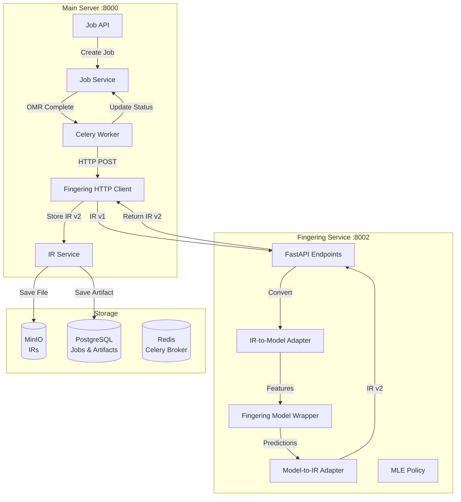

# Phase 3

: Fingering AI Service Implementation

## Overview

This phase implements the **intelligence layer** of Étude: using the PRamoneda/Automatic-Piano-Fingering model (ArLSTM/ArGNN) to infer optimal piano fingering from Symbolic IR v1. The service operates entirely on symbolic notation, preserves uncertainty from OMR, and produces IR v2 with fingering annotations.

## Architecture

## Implementation Tasks

### Task 3.1: Clone PRamoneda Repository & Service Structure

**Files to create:**

- `services/fingering/Dockerfile` - Container definition
- `services/fingering/requirements.txt` - Python dependencies (torch, torch-geometric, fastapi, etc.)
- `services/fingering/app/__init__.py` - Package initialization
- `services/fingering/app/main.py` - FastAPI application
- `services/fingering/app/config.py` - Configuration with Pydantic Settings
- `services/fingering/README.md` - Service documentation

**Actions:**

- Clone PRamoneda repository into `services/fingering/Automatic-Piano-Fingering/`
- Create directory structure matching OMR service pattern
- Set up conditional model loading (works without weights for development)

### Task 3.2: IR v2 Schema Extensions

**Files to create:**

- `server/app/schemas/symbolic_ir/v2/__init__.py`
- `server/app/schemas/symbolic_ir/v2/fingering.py` - FingeringAnnotation model
- `server/app/schemas/symbolic_ir/v2/schema.py` - SymbolicScoreIRV2 extending v1

**Files to modify:**

- `server/app/schemas/symbolic_ir/version_registry.py` - Register v2.0.0 schema
- `server/app/schemas/symbolic_ir/__init__.py` - Export v2 schemas

**Design:**

- IR v2 extends IR v1 (inherits all fields)
- Adds optional `fingering` field to `NoteEvent`
- Adds `fingering_metadata` to top-level IR
- Version: "2.0.0"

### Task 3.3: Fingering Model Wrapper

**Files to create:**

- `services/fingering/app/models/__init__.py`
- `services/fingering/app/models/fingering_model.py` - Model wrapper with conditional loading
- `services/fingering/app/models/model_loader.py` - Model weight loading utilities

**Implementation:**

- Wrapper class for ArLSTM/ArGNN models
- Conditional loading: works with or without pretrained weights
- Device detection (CPU/GPU)
- Prediction interface returning finger assignments with confidence
- Graceful degradation if model unavailable

### Task 3.4: IR-to-Model Adapter

**Files to create:**

- `services/fingering/app/adapters/__init__.py`
- `services/fingering/app/adapters/ir_to_model_adapter.py` - Convert IR v1 to model input

**Key responsibilities:**

- Extract ordered note sequences from IR v1
- Apply MLE uncertainty policy (resolve hand/voice assignments)
- Separate notes by hand (left/right)
- Extract features: pitch, duration, IOI, metric position, chord info
- Generate PyTorch tensors for model input
- Track adapter version for lineage

### Task 3.5: Model-to-IR Adapter

**Files to create:**

- `services/fingering/app/adapters/model_to_ir_adapter.py` - Convert predictions to IR v2

**Key responsibilities:**

- Map model predictions back to note IDs
- Create FingeringAnnotation objects
- Annotate IR v1 notes to create IR v2
- Add fingering metadata (coverage, model info, policy used)
- Preserve all IR v1 fields

### Task 3.6: Uncertainty Policy Implementation

**Files to create:**

- `services/fingering/app/policies/__init__.py`
- `services/fingering/app/policies/uncertainty_policy.py` - Base class and MLE policy
- `services/fingering/app/policies/mle_policy.py` - MLE implementation

**Implementation:**

- Abstract base class for policies
- MLE policy: select most probable hand/voice assignments
- Hand inference from staff ID or pitch when uncertain
- Extensible for future sampling-based policies

### Task 3.7: FastAPI Service Implementation

**Files to create:**

- `services/fingering/app/schemas/__init__.py`
- `services/fingering/app/schemas/request.py` - Request schemas
- `services/fingering/app/schemas/response.py` - Response schemas (FingeringResponse, HealthResponse)

**Files to modify:**

- `services/fingering/app/main.py` - Complete FastAPI app with:
- `/health` endpoint
- `/infer` endpoint (POST with IR v1, returns IR v2)
- `/info` endpoint
- Model preloading on startup
- Error handling

### Task 3.8: Celery Infrastructure Setup

**Files to create:**

- `server/app/celery_app.py` - Celery app configuration
- `server/app/tasks/__init__.py`
- `server/app/tasks/fingering_tasks.py` - Celery task for fingering processing

**Files to modify:**

- `server/app/config.py` - Add `FINGERING_SERVICE_URL` and Celery config
- `server/app/services/omr_processor.py` - Trigger fingering task after OMR completes
- `server/requirements.txt` - Add celery, redis dependencies
- `server/Dockerfile` - Add Celery worker command option

**Celery setup:**

- Configure Celery with Redis broker
- Create `process_fingering_task` async task
- Task loads IR v1, calls fingering service, stores IR v2
- Updates job status through pipeline

### Task 3.9: Fingering Service Client

**Files to create:**

- `server/app/services/fingering_client.py` - HTTP client for fingering service

**Implementation:**

- Similar to `omr_client.py` pattern
- Async HTTP client with retry logic
- Error handling and timeout configuration
- Returns IR v2 from service response

### Task 3.10: IR Service Updates

**Files to modify:**

- `server/app/services/ir_service.py` - Add support for IR v2:
- Update `store_ir` to handle IR v2 schema version
- Update storage paths: `ir/v2/{artifact_id}.json`
- Update artifact type detection
- Support loading IR v2 artifacts

### Task 3.11: Docker Compose Integration

**Files to modify:**

- `docker-compose.yml` - Add:
- `fingering-service` container (port 8002)
- `celery-worker` service (optional, or run in server container)
- Environment variables for fingering service
- Volume mounts for model weights
- Health checks

### Task 3.12: Testing

**Files to create:**

- `services/fingering/tests/__init__.py`
- `services/fingering/tests/test_adapter.py` - Test IR-to-Model and Model-to-IR adapters
- `services/fingering/tests/test_inference.py` - Test model inference (with mocks)
- `services/fingering/tests/test_policies.py` - Test uncertainty policies
- `server/tests/test_fingering_integration.py` - Integration tests

**Test coverage:**

- Adapter conversion logic
- Feature extraction correctness
- Uncertainty policy resolution
- End-to-end pipeline: OMR → Fingering → IR v2
- Error handling and edge cases

## Key Design Decisions

1. **IR v2 Schema**: Extends v1 rather than separate schema for backward compatibility
2. **Model Integration**: Conditional loading allows development without weights
3. **Uncertainty Handling**: MLE policy for production, extensible for research
4. **Celery Integration**: Async task processing for long-running inference
5. **Version Tracking**: Adapter versions tracked in metadata for reproducibility
6. **Hand Separation**: Critical for accurate fingering; uses staff/pitch heuristics when uncertain

## Files Summary

**New files (fingering service):**

- `services/fingering/Dockerfile`
- `services/fingering/requirements.txt`
- `services/fingering/app/main.py`
- `services/fingering/app/config.py`
- `services/fingering/app/models/fingering_model.py`
- `services/fingering/app/models/model_loader.py`
- `services/fingering/app/adapters/ir_to_model_adapter.py`
- `services/fingering/app/adapters/model_to_ir_adapter.py`
- `services/fingering/app/policies/uncertainty_policy.py`
- `services/fingering/app/policies/mle_policy.py`
- `services/fingering/app/schemas/request.py`
- `services/fingering/app/schemas/response.py`
- `services/fingering/tests/test_adapter.py`
- `services/fingering/tests/test_inference.py`
- `services/fingering/README.md`

**New files (main server):**

- `server/app/celery_app.py`
- `server/app/tasks/__init__.py`
- `server/app/tasks/fingering_tasks.py`
- `server/app/services/fingering_client.py`
- `server/app/schemas/symbolic_ir/v2/__init__.py`
- `server/app/schemas/symbolic_ir/v2/fingering.py`
- `server/app/schemas/symbolic_ir/v2/schema.py`
- `server/tests/test_fingering_integration.py`

**Modified files:**

- `docker-compose.yml` - Add fingering service and Celery worker
- `server/app/config.py` - Add fingering service URL and Celery config
- `server/app/services/ir_service.py` - Support IR v2 storage/loading
- `server/app/services/omr_processor.py` - Trigger fingering after OMR
- `server/app/schemas/symbolic_ir/version_registry.py` - Register v2.0.0
- `server/requirements.txt` - Add celery, redis, httpx
- `server/Dockerfile` - Optional Celery worker setup

## Critical Implementation Notes

1. **Model Weights**: Service must work without weights for development. Add graceful degradation.
2. **Feature Engineering**: Feature extraction must match PRamoneda model expectations (verify from model docs).
3. **Sequence Handling**: Handle variable-length sequences; may need padding/truncation for batching.
4. **Hand Assignment**: Accurate hand separation is critical; MLE policy must handle edge cases.
5. **IR v2 Validation**: Ensure IR v2 passes schema validation and maintains backward compatibility.

## Acceptance Criteria

- [ ] PRamoneda repository cloned and integrated
- [ ] Fingering service Docker container builds and runs
- [ ] Health check endpoint returns healthy status
- [ ] Model loads successfully (or graceful degradation works)
- [ ] IR-to-Model adapter extracts features correctly
- [ ] MLE uncertainty policy resolves ambiguities
- [ ] Fingering model inference runs (with mocks if no weights)
- [ ] Model-to-IR adapter creates valid IR v2
- [ ] IR v2 stored as artifact with correct lineage
- [ ] Celery task processes fingering asynchronously
- [ ] Full pipeline: PDF → OMR → Fingering → IR v2 works