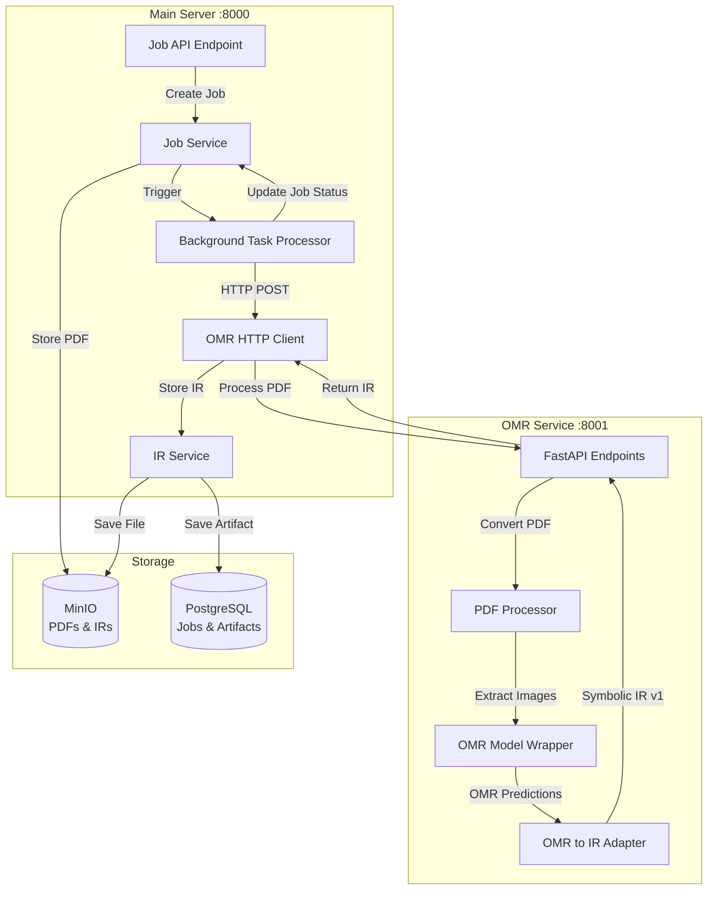

# Phase 2: OMR Service Integration

## Overview

This phase implements the **perception layer** of Étude: converting scanned sheet music PDFs into the Symbolic Score IR v1 through Optical Music Recognition (OMR). The OMR service runs as an independent, containerized microservice that integrates with the main FastAPI server's job processing pipeline.

## Architecture

## Implementation Tasks

### Task 2.1: OMR Service Structure & Containerization

**Files to create:**
- `services/omr/Dockerfile` - Replace placeholder with full containerization
- `services/omr/requirements.txt` - Python dependencies
- `services/omr/app/__init__.py` - Package initialization
- `services/omr/app/main.py` - FastAPI application with health check
- `services/omr/app/config.py` - Configuration management
- `services/omr/README.md` - Service documentation

**Key implementation details:**
- Use Python 3.11-slim base image with system dependencies (poppler-utils, OpenCV libs)
- Expose port 8001
- Health check endpoint for container orchestration
- Environment-based configuration

### Task 2.2: OMR Model Wrapper

**Files to create:**
- `services/omr/app/models/__init__.py`
- `services/omr/app/models/omr_model.py` - Model wrapper with skeleton implementation

**Key implementation details:**
- Create `OMRModel` class with placeholder loading logic
- Add TODOs for actual Polyphonic-TrOMR integration
- Implement preprocessing pipeline (image normalization, tensor conversion)
- Create `_generate_placeholder_predictions()` method for development/testing
- Global singleton pattern for model instance

### Task 2.3: PDF Processing Utilities

**Files to create:**
- `services/omr/app/utils/__init__.py`
- `services/omr/app/utils/pdf_processor.py` - PDF to image conversion
- `services/omr/app/utils/confidence.py` - Confidence score utilities (if needed)

**Key implementation details:**
- Use `pdf2image` library for PDF conversion
- Configurable DPI (default 300)
- Page limit validation
- PDF file validation (header check, size limits)
- Convert PIL Images to numpy arrays for model input

### Task 2.4: OMR to IR Adapter

**Files to create:**
- `services/omr/app/adapters/__init__.py`
- `services/omr/app/adapters/ir_adapter.py` - Critical conversion logic

**Key implementation details:**
- Convert OMR predictions → Symbolic IR v1 format
- Map OMR detections to IR note events with proper structure
- Create dual time representation (seconds + beats) using tempo
- Preserve confidence scores from OMR model
- Handle voice/hand assignment with uncertainty
- Generate chord groupings for simultaneous notes
- Build complete IR metadata with provenance
- **Fix incomplete `_infer_hand_assignment` method** from user's snippet

**Critical adapter methods:**
- `convert()` - Main conversion entry point
- `_convert_page()` - Per-page conversion
- `_convert_note()` - Single note to IR NoteEvent
- `_extract_voices()` - Voice structure extraction
- `_build_metadata()` - IR metadata construction

### Task 2.5: OMR Service API

**Files to create:**
- `services/omr/app/schemas/__init__.py`
- `services/omr/app/schemas/request.py` - Request schemas
- `services/omr/app/schemas/response.py` - Response schemas

**API endpoints:**
- `POST /process` - Main OMR processing endpoint (accepts PDF bytes, returns IR JSON)
- `GET /health` - Health check endpoint
- `GET /info` - Service metadata (model version, capabilities)

**Request/Response schemas:**
- `OMRProcessRequest` - PDF bytes, optional metadata
- `OMRProcessResponse` - IR JSON, processing metadata, confidence summary

### Task 2.6: Main Server Integration

**Files to create/modify:**
- `server/app/services/omr_client.py` - HTTP client for OMR service
- `server/app/services/omr_processor.py` - Background task processor
- `server/app/config.py` - Add OMR service configuration
- `server/app/api/v1/jobs.py` - Trigger OMR processing after job creation

**Key implementation details:**
- HTTP client using `httpx` for async calls to OMR service
- Retry logic with exponential backoff (using `tenacity`)
- Error handling and timeout management
- Background task function to process jobs asynchronously
- Update job status transitions: `PENDING` → `OMR_PROCESSING` → `OMR_COMPLETED`/`OMR_FAILED`
- Store IR artifact using `IRService.store_ir()`
- Create artifact lineage linking PDF → IR

**Integration flow:**
1. User uploads PDF → Job created with status `PENDING`
2. Background task triggered → Status → `OMR_PROCESSING`
3. Download PDF from MinIO
4. Call OMR service `/process` endpoint
5. Receive IR JSON, validate against schema
6. Store IR artifact, update job status → `OMR_COMPLETED`
7. Handle errors → Status → `OMR_FAILED`

### Task 2.7: Docker Compose Integration

**Files to modify:**
- `docker-compose.yml` - Add OMR service definition

**Service configuration:**
- Add `omr` service with build context `./services/omr`
- Port mapping: `8001:8001`
- Environment variables for OMR configuration
- Health check configuration
- Network: `etude_network`
- Dependencies: None (independent service)

### Task 2.8: Testing & Validation

**Files to create:**
- `services/omr/tests/__init__.py`
- `services/omr/tests/test_omr.py` - Unit tests for OMR service
- `services/omr/tests/fixtures/sample_scores/` - Test PDF fixtures
- `server/tests/test_omr_integration.py` - Integration tests

**Test coverage:**
- PDF processing utilities
- IR adapter conversion logic
- OMR service API endpoints
- Main server OMR client integration
- End-to-end job processing flow
- Error handling and retry logic

## Key Design Decisions

1. **Async Processing**: Implement background task pattern (can be upgraded to Celery later)
2. **Model Integration**: Skeleton code with TODOs for actual Polyphonic-TrOMR integration
3. **Error Handling**: Comprehensive retry logic with exponential backoff
4. **IR Validation**: Validate IR against Pydantic schema before storage
5. **Artifact Lineage**: Track PDF → IR transformation in artifact lineage table

## Files Summary

**New files (OMR service):**
- `services/omr/Dockerfile`
- `services/omr/requirements.txt`
- `services/omr/app/main.py`
- `services/omr/app/config.py`
- `services/omr/app/models/omr_model.py`
- `services/omr/app/adapters/ir_adapter.py`
- `services/omr/app/utils/pdf_processor.py`
- `services/omr/app/schemas/request.py`
- `services/omr/app/schemas/response.py`
- `services/omr/tests/test_omr.py`
- `services/omr/README.md`

**New files (main server):**
- `server/app/services/omr_client.py`
- `server/app/services/omr_processor.py`
- `server/tests/test_omr_integration.py`

**Modified files:**
- `docker-compose.yml` - Add OMR service
- `server/app/config.py` - Add OMR service URL config
- `server/app/api/v1/jobs.py` - Trigger background processing
- `server/app/main.py` - Initialize background task processor (if needed)

## Dependencies

**OMR service:**
- FastAPI, uvicorn
- PyTorch (for model inference)
- pdf2image, Pillow (PDF/image processing)
- httpx, tenacity (for retries)

**Main server:**
- httpx (for OMR service calls)
- tenacity (for retry logic)

## Notes

- The `_infer_hand_assignment` method in the user's snippet is incomplete and will be completed
- OMR model loading is skeleton code - actual Polyphonic-TrOMR integration marked with TODOs
- Background task processing uses simple async pattern - can be upgraded to Celery in future
- IR adapter is the critical component ensuring proper conversion to Symbolic IR v1 format