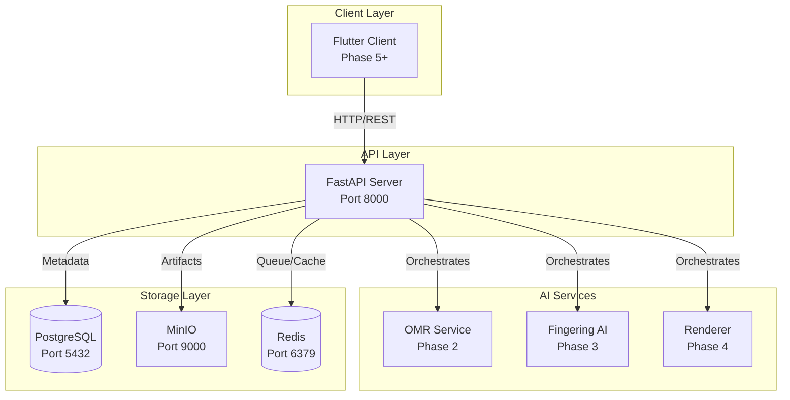

# Phase 0: Project Setup & Infrastructure

## Overview

This plan establishes the complete development environment and foundational infrastructure for Étude, a research-grade pipeline for converting scanned sheet music into piano fingering annotations. The system uses a symbolic-first architecture with FastAPI orchestration, containerized AI services, PostgreSQL for metadata, and MinIO for object storage.

## Architecture Overview




## Implementation Plan

### 1. Monorepo Structure & Base Files

Create the complete directory structure and foundational configuration files:

- **Root files**: `docker-compose.yml`, `.env.example`, `README.md`, `.gitignore`
- **Documentation**: `docs/architecture.md` with system overview
- **Server structure**: Complete FastAPI application structure in `server/`
- **Service placeholders**: Dockerfiles for `services/omr/`, `services/fingering/`, `services/renderer/`
- **Scripts**: `scripts/setup_local.sh`, `scripts/seed_db.py`
- **Client placeholder**: `client/` directory for future Flutter app

Key files to create:

- `server/pyproject.toml` - Python project configuration with dependencies
- `server/requirements.txt` - Python dependencies (FastAPI, SQLAlchemy 2.0+, Pydantic v2, etc.)
- `server/alembic.ini` - Alembic migration configuration
- `.gitignore` - Python, Docker, IDE, and environment files

### 2. Docker Compose Configuration

Create `docker-compose.yml` with four services:**PostgreSQL Service**:

- Image: `postgres:15-alpine`
- Port: 5432
- Database: `etude_dev`
- Persistent volume: `postgres_data`
- Health check: `pg_isready`

**MinIO Service**:

- Image: `minio/minio:latest`
- Ports: 9000 (API), 9001 (Console)
- Persistent volume: `minio_data`
- Environment: Access key, secret key, bucket creation script
- Health check: MinIO health endpoint

**Redis Service**:

- Image: `redis:7-alpine`
- Port: 6379
- Persistent volume: `redis_data`
- Health check: `redis-cli ping`

**FastAPI Server**:

- Build from `server/Dockerfile`
- Port: 8000
- Depends on: postgres, minio, redis
- Volume mount: `./server:/app` for hot reload
- Environment variables from `.env`

**`.env.example`**:

- Database connection string
- MinIO credentials and endpoints
- Redis URL
- JWT secret key and algorithm
- CORS allowed origins
- Environment (dev/staging/prod)
- Log level

### 3. Database Schema & Models

Implement SQLAlchemy models with async support:**Models** (`server/app/models/`):

- `user.py`: User model with UUID primary key, email (unique), hashed_password, full_name, is_active, timestamps
- `job.py`: Job model with UUID, user_id (FK), status enum, stage enum, timestamps, error_message, metadata JSONB
- `artifact.py`: Artifact model with UUID, job_id (FK), artifact_type enum, schema_version, storage_path, file_size, checksum, metadata JSONB, parent_artifact_id (FK, nullable)
- `artifact_lineage.py`: Lineage model with UUID, source_artifact_id (FK), derived_artifact_id (FK), transformation_type, transformation_version, timestamp

**Schemas** (`server/app/schemas/`):

- Pydantic v2 schemas for all models (create, read, update variants)
- Validation for enums, UUIDs, JSONB fields
- Response models with computed fields

**Database Setup** (`server/app/db/`):

- `base.py`: Declarative base for models
- `session.py`: Async engine, session factory, dependency injection
- Connection pooling configuration

**Alembic Migration**:

- Initial migration creating all tables
- Indexes on: jobs.user_id, jobs.status, artifacts.job_id, artifacts.artifact_type, lineage foreign keys
- Enum types for status, stage, artifact_type

### 4. FastAPI Application Foundation

**Configuration** (`server/app/config.py`):

- Pydantic Settings class with environment variable loading
- Database URL (async PostgreSQL)
- MinIO/S3 configuration (endpoint, access key, secret key, bucket names)
- Redis URL
- JWT settings (secret, algorithm, expiration)
- CORS origins
- Environment and log level

**Main Application** (`server/app/main.py`):

- FastAPI app with metadata (title: "Étude API", version: "0.1.0")
- CORS middleware configuration
- Startup event: verify database connection, ensure MinIO buckets exist
- Shutdown event: close database connections
- Global exception handlers (404, 500, validation errors)
- Include routers from `app/api/v1/`

**Health Check** (`server/app/api/v1/health.py`):

- `GET /health`: Simple health check
- `GET /health/detailed`: Component health (database, MinIO, Redis)
- Return JSON with status and component details

### 5. Storage Service

**Storage Service** (`server/app/services/storage_service.py`):

- `StorageService` class using `aioboto3` for async S3/MinIO operations
- Methods:
- `upload_file(file: bytes, key: str, bucket: str) -> str`: Upload and return storage path
- `download_file(key: str, bucket: str) -> bytes`: Download file content
- `delete_file(key: str, bucket: str) -> bool`: Delete file
- `generate_presigned_url(key: str, bucket: str, expiration: int) -> str`: Generate presigned URL
- `get_file_metadata(key: str, bucket: str) -> dict`: Get file metadata (size, etag, etc.)
- Bucket initialization on startup
- Error handling for storage operations

### 6. Job State Machine

**State Machine** (`server/app/core/state_machine.py`):

- `JobStatus` enum with all states (PENDING, OMR_PROCESSING, OMR_COMPLETED, OMR_FAILED, FINGERING_PROCESSING, FINGERING_COMPLETED, FINGERING_FAILED, RENDERING_PROCESSING, COMPLETED, FAILED)
- `JobStage` enum (OMR, FINGERING, RENDERING)
- Valid transition matrix
- `validate_transition(current: JobStatus, next: JobStatus) -> bool`
- Transition validation with error messages

**Job Service** (`server/app/services/job_service.py`):

- `JobService` class with async methods:
- `create_job(user_id: UUID, pdf_file: bytes) -> Job`: Create job, store PDF as artifact
- `get_job(job_id: UUID) -> Job`: Get job by ID
- `list_user_jobs(user_id: UUID, filters: dict) -> List[Job]`: Paginated, filterable list
- `update_job_status(job_id: UUID, status: JobStatus) -> Job`: Atomic status update with validation
- `record_error(job_id: UUID, error_message: str) -> Job`: Update job with error
- `get_job_artifacts(job_id: UUID) -> List[Artifact]`: Get all artifacts for job
- Audit trail in job metadata JSONB field
- Atomic database operations using transactions

### 7. Artifact Management

**Artifact Service** (`server/app/services/artifact_service.py`):

- `ArtifactService` class with methods:

**Storage**:

- `store_artifact(job_id, artifact_type, data, metadata, parent_id) -> Artifact`
- Generate deterministic storage keys: `jobs/{job_id}/artifacts/{artifact_id}.{ext}`
- Calculate SHA256 checksum
- Store in MinIO + create database record atomically
- Record lineage if parent_id provided

**Retrieval**:

- `get_artifact(artifact_id: UUID) -> tuple[Artifact, bytes]`: Get artifact and data
- `get_artifact_by_job_and_type(job_id: UUID, artifact_type: str) -> Artifact`: Get latest artifact of type
- `get_artifact_lineage(artifact_id: UUID) -> List[Artifact]`: Get ancestors and descendants via lineage table

**Versioning**:

- Track schema versions per artifact type
- Validate artifact data structure (basic validation)
- Support multiple schema versions concurrently

**Metadata**:

- Store model versions (e.g., "PRamoneda-ArLSTM-v1.2.3")
- Store adapter versions
- Store transformation parameters
- Store uncertainty policies
- Immutable artifacts (no updates, only new versions)

### 8. Authentication & Security

**Security Module** (`server/app/core/security.py`):

- `create_access_token(data: dict, expires_delta: timedelta) -> str`: JWT token creation
- `verify_password(plain: str, hashed: str) -> bool`: Password verification
- `get_password_hash(password: str) -> str`: Bcrypt hashing (passlib)
- `decode_access_token(token: str) -> dict`: JWT token decoding with validation

**Dependencies** (`server/app/dependencies.py`):

- `get_current_user(token: str = Depends(oauth2_scheme)) -> User`: Extract token, decode, fetch user
- `get_current_active_user(current_user: User = Depends(get_current_user)) -> User`: Check is_active flag
- OAuth2 password bearer scheme

**Auth Endpoints** (`server/app/api/v1/auth.py`):

- `POST /auth/register`: Create user (email, password, full_name) -> User
- `POST /auth/login`: Authenticate (email, password) -> Access token
- `GET /auth/me`: Get current user info (protected)

### 9. API Endpoints

**Jobs Router** (`server/app/api/v1/jobs.py`):

- `POST /jobs`: Create job (multipart form with PDF file)
- Authenticate user
- Validate PDF file
- Store PDF as artifact
- Create job record
- Return job ID and status (201)
- `GET /jobs/{job_id}`: Get job details (404 if not found, 403 if not owner)
- `GET /jobs`: List user's jobs (query params: status, stage, limit, offset)
- `DELETE /jobs/{job_id}`: Delete job and all artifacts (204)

**Artifacts Router** (`server/app/api/v1/artifacts.py`):

- `GET /artifacts/{artifact_id}`: Get artifact metadata (404 if not found)
- `GET /artifacts/{artifact_id}/download`: Download artifact data (stream response)
- `GET /artifacts/{artifact_id}/lineage`: Get lineage graph (ancestors and descendants)
- `GET /jobs/{job_id}/artifacts`: List all artifacts for job

All endpoints:

- Require authentication (use `get_current_active_user` dependency)
- Proper error handling (404, 403, 500)
- Consistent JSON response format
- OpenAPI documentation with examples

### 10. Development Tooling

**Database Seeding** (`scripts/seed_db.py`):

- Create test users (admin, regular users)
- Create sample jobs in various states (pending, processing, completed, failed)
- Generate mock artifacts for testing (PDF, IR, MusicXML)
- Link artifacts with lineage relationships

**Setup Script** (`scripts/setup_local.sh`):

- Check Docker and Docker Compose installation
- Create `.env` from `.env.example` if not exists
- Start services: `docker-compose up -d`
- Wait for health checks (PostgreSQL, MinIO, Redis)
- Run Alembic migrations: `alembic upgrade head`
- Create MinIO buckets (etude-artifacts, etude-pdfs)
- Optionally seed database (with flag)
- Print connection info and next steps

**Logging Configuration**:

- Use `structlog` for structured JSON logging
- Configure in `server/app/config.py` and `server/app/main.py`
- Log levels per environment (DEBUG for dev, INFO for prod)
- Request ID middleware (generate UUID per request)
- Correlation IDs for jobs (store in job metadata, include in logs)

**Testing Setup**:

- `pytest.ini` configuration
- `conftest.py` with fixtures:
- Database session (test database, reset between tests)
- Test client (FastAPI TestClient)
- Mock storage service
- Test user creation
- Example unit tests:
- `tests/test_models.py`: Model validation
- `tests/test_services.py`: Job service, artifact service
- `tests/test_api.py`: API endpoint tests

### 11. Documentation

**README.md** (root):

- Project overview and goals
- Architecture diagram (text-based or reference to docs)
- Quick start guide (setup script usage)
- Development setup instructions
- Common commands (docker-compose, migrations, tests)
- Technology stack

**docs/architecture.md**:

- System components overview
- Data flow through pipeline stages (OMR → Fingering → Rendering)
- Symbolic IR rationale (why not direct PDF→MusicXML)
- Technology choices (FastAPI, async SQLAlchemy, MinIO, etc.)
- Job lifecycle and state transitions
- Artifact versioning and lineage strategy

**API Documentation**:

- FastAPI auto-generates OpenAPI at `/docs`
- Add detailed docstrings to all endpoints
- Include request/response examples
- Document authentication flow
- Document artifact types and schema versions

## File Structure Summary

```javascript
etude/
├── docker-compose.yml
├── .env.example
├── .gitignore
├── README.md
├── docs/
│   └── architecture.md
├── server/
│   ├── Dockerfile
│   ├── requirements.txt
│   ├── pyproject.toml
│   ├── alembic.ini
│   ├── pytest.ini
│   ├── conftest.py
│   ├── app/
│   │   ├── __init__.py
│   │   ├── main.py
│   │   ├── config.py
│   │   ├── dependencies.py
│   │   ├── api/
│   │   │   ├── __init__.py
│   │   │   └── v1/
│   │   │       ├── __init__.py
│   │   │       ├── health.py
│   │   │       ├── auth.py
│   │   │       ├── jobs.py
│   │   │       └── artifacts.py
│   │   ├── models/
│   │   │   ├── __init__.py
│   │   │   ├── user.py
│   │   │   ├── job.py
│   │   │   ├── artifact.py
│   │   │   └── artifact_lineage.py
│   │   ├── schemas/
│   │   │   ├── __init__.py
│   │   │   ├── user.py
│   │   │   ├── job.py
│   │   │   ├── artifact.py
│   │   │   └── artifact_lineage.py
│   │   ├── services/
│   │   │   ├── __init__.py
│   │   │   ├── job_service.py
│   │   │   ├── artifact_service.py
│   │   │   └── storage_service.py
│   │   ├── core/
│   │   │   ├── __init__.py
│   │   │   ├── security.py
│   │   │   └── state_machine.py
│   │   └── db/
│   │       ├── __init__.py
│   │       ├── base.py
│   │       └── session.py
│   ├── alembic/
│   │   ├── env.py
│   │   └── versions/
│   │       └── 001_initial_schema.py
│   └── tests/
│       ├── __init__.py
│       ├── test_models.py
│       ├── test_services.py
│       └── test_api.py
├── services/
│   ├── omr/
│   │   └── Dockerfile
│   ├── fingering/
│   │   └── Dockerfile
│   └── renderer/
│       └── Dockerfile
├── client/
└── scripts/
    ├── setup_local.sh
    └── seed_db.py
```


## Key Dependencies

**Python Packages**:

- `fastapi>=0.104.0`
- `uvicorn[standard]>=0.24.0`
- `sqlalchemy[asyncio]>=2.0.0`
- `alembic>=1.12.0`
- `pydantic>=2.5.0`
- `pydantic-settings>=2.1.0`
- `aioboto3>=12.0.0`
- `passlib[bcrypt]>=1.7.4`
- `python-jose[cryptography]>=3.3.0`
- `python-multipart>=0.0.6`
- `structlog>=23.2.0`
- `pytest>=7.4.0`
- `pytest-asyncio>=0.21.0`
- `httpx>=0.25.0` (for testing)

## Testing Strategy

After implementation, verify:

1. All services start successfully with `docker-compose up`
2. Database migrations run without errors
3. MinIO buckets are created automatically
4. Health check returns healthy for all components
5. User registration and login work
6. JWT tokens are generated and validated
7. Job creation stores PDF as artifact
8. Job listing and filtering work