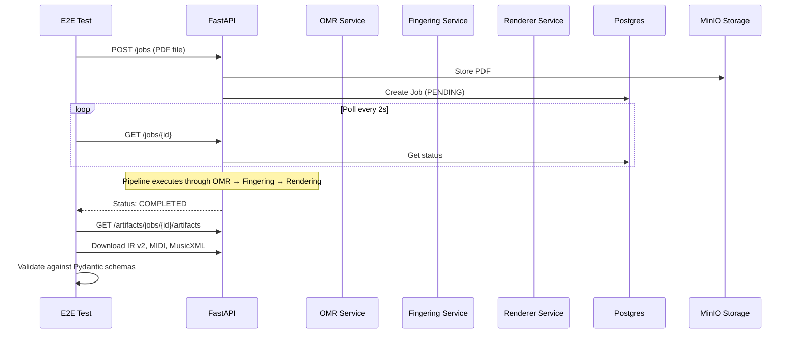

# Phase 7: Integration and E2E Testing

## Architecture Overview



---

## Step 1: Backend E2E Pipeline Test

Create [`server/tests/e2e/test_pipeline_flow.py`](server/tests/e2e/test_pipeline_flow.py):**Key Implementation Details:**

- Use `httpx.AsyncClient` pointing to real running server (not test client)
- Authenticate using a test user created via fixtures
- Upload a real PDF file and poll until completion
- Validate IR v2 JSON against `SymbolicScoreIRV2` schema from [`server/app/schemas/symbolic_ir/v2/schema.py`](server/app/schemas/symbolic_ir/v2/schema.py)
- Verify artifact downloads return 200 with non-empty content
- Assert total pipeline time is under 30 seconds

**Configuration:**

- Create [`server/tests/e2e/conftest.py`](server/tests/e2e/conftest.py) with fixtures for:
- Base URL configuration (from env or default `http://localhost:8000`)
- Authentication token fixture
- Sample PDF file path fixture

---

## Step 2: Error Handling and Resilience

### 2.1 Bad Input Test

Add `test_invalid_file_upload` in the E2E suite:

- Send a `.txt` file to `POST /jobs`
- Verify HTTP 400 response with `"File must be a PDF"` message
- Already implemented in [`server/app/api/v1/jobs.py:35-38`](server/app/api/v1/jobs.py) - just need test coverage

### 2.2 Service Failure Simulation

Create [`server/tests/e2e/test_error_handling.py`](server/tests/e2e/test_error_handling.py):

- Test OMR failure by uploading a corrupted/invalid PDF
- Verify job transitions to `FAILED` or stage-specific failure status (`OMR_FAILED`, `FINGERING_FAILED`)
- Verify `error_message` field is populated

### 2.3 Graceful Degradation (Partial Completion)

Modify [`server/app/tasks/fingering_tasks.py`](server/app/tasks/fingering_tasks.py) to handle rendering failures gracefully:

```python
# When rendering fails after fingering succeeds:
# - Set status to COMPLETED (not FAILED)
# - Add partial flag to job_metadata
job.job_metadata["partial"] = True
job.job_metadata["completed_stages"] = ["omr", "fingering"]
job.job_metadata["failed_stages"] = ["rendering"]
```

Update [`server/app/schemas/job.py`](server/app/schemas/job.py) `JobResponse` to expose this metadata so clients can detect partial completion.---

## Step 3: Flutter Integration Test

Create [`client/integration_test/app_test.dart`](client/integration_test/app_test.dart):**Setup:**

- Add `integration_test` to [`client/pubspec.yaml`](client/pubspec.yaml) dev_dependencies
- Use `IntegrationTestWidgetsFlutterBinding.ensureInitialized()`

**Test Flow:**

1. Launch app via `pumpWidget(ProviderScope(child: EtudeApp()))`
2. Find and tap upload button (text: "Tap to select PDF" or icon)
3. Mock `FilePicker.platform` to return a test PDF
4. Wait for processing indicator (CircularProgressIndicator)
5. Wait for ScoreViewerScreen to appear (detect `ScoreSvgViewer` widget)
6. Find play button in `PlaybackBar` and tap
7. Verify playback state changes (isPlaying becomes true)

**Key Widgets to Target:**

- Upload area: `InkWell` with `Icons.cloud_upload_outlined` in [`upload_screen.dart`](client/lib/features/upload/screens/upload_screen.dart)
- Score viewer: `ScoreSvgViewer` widget
- Playback: `PlaybackBar` with play/pause `IconButton`

---

## File Structure

```javascript
server/tests/e2e/
  __init__.py
  conftest.py              # E2E fixtures (auth, base URL, sample files)
  test_pipeline_flow.py    # Happy path E2E test
  test_error_handling.py   # Unhappy path tests

client/integration_test/
  app_test.dart            # Flutter integration test
```

---

## Test Execution Commands

```bash
# Backend E2E (requires running containers)
cd server
pytest tests/e2e -v --tb=short

# Flutter integration test
cd client
flutter test integration_test/app_test.dart


```