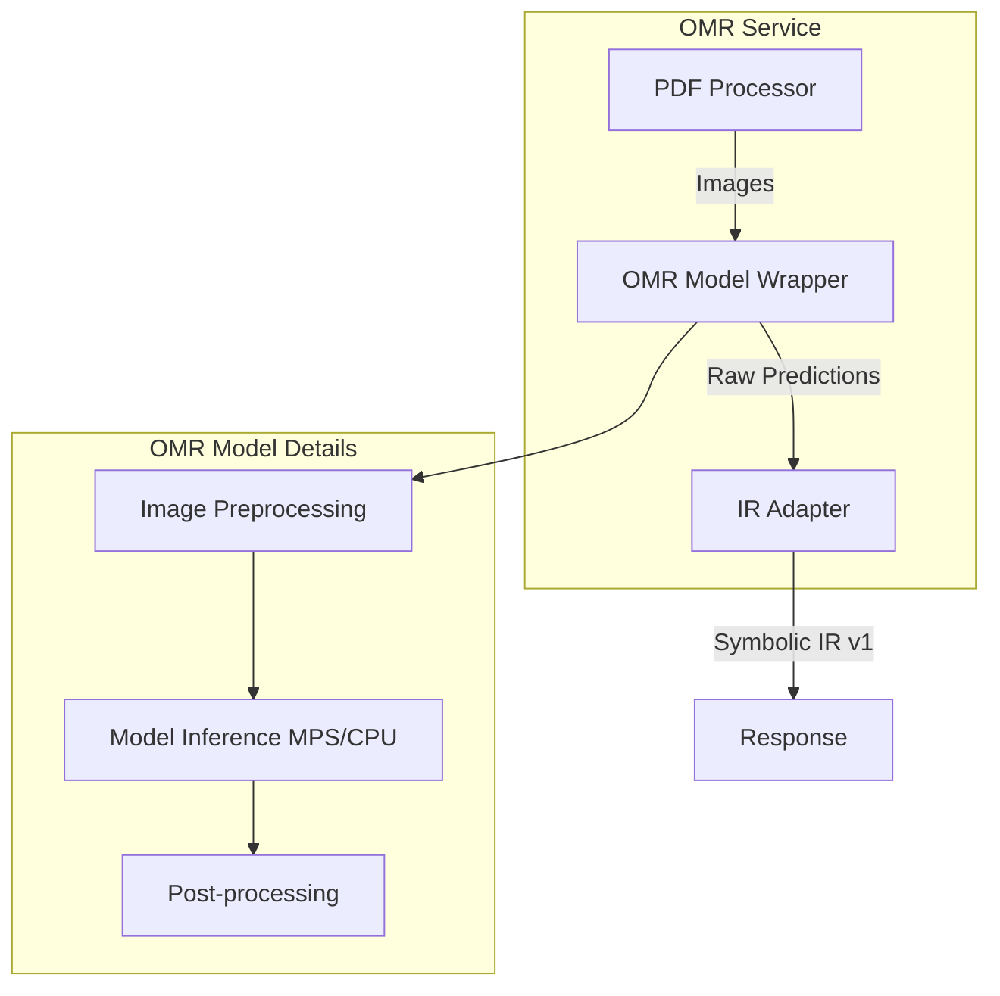

# Polyphonic-TrOMR OMR Service Integration

## Overview

Replace the skeleton `OMRModel` class in `services/omr/app/models/omr_model.py` with a complete Polyphonic-TrOMR integration. The implementation will handle model loading, MPS device configuration for Apple Silicon, image preprocessing, inference, and conversion to Symbolic IR v1 format.

## Architecture




## Implementation Tasks

### Task 0: Clone Polyphonic-TrOMR Repository

**Location**: `services/omr/Polyphonic-TrOMR/`

- Clone the repository: `git clone https://github.com/NetEase/Polyphonic-TrOMR.git services/omr/Polyphonic-TrOMR/`
- Review the repository structure to understand:
- Model loading API (`tromr/inference.py` or similar)
- Expected input format (image preprocessing requirements)
- Output format (how predictions are structured)
- Dependencies in `requirements.txt`
- Update `.gitignore` if needed (decide whether to track the clone or add it to gitignore)

### Task 1: Update Dependencies

**File**: `services/omr/requirements.txt`

- Add `structlog>=23.2.0` for JSON logging (matching main server)
- Ensure PyTorch version supports MPS (torch>=2.0.0)
- Review `services/omr/Polyphonic-TrOMR/requirements.txt` and add any missing dependencies
- Note: Polyphonic-TrOMR code will be imported directly from the local clone

### Task 2: Update Configuration

**File**: `services/omr/app/config.py`

- Update `device` default to support MPS detection: `"mps" if torch.backends.mps.is_available() else "cpu"`
- Add `model_weights_path` configuration option
- Add `model_config_path` if needed by Polyphonic-TrOMR
- Add environment variable support for model paths

### Task 3: Implement Real OMRModel Class

**File**: `services/omr/app/models/omr_model.py`**Key changes:**

1. **Model Loading** (`_load_model` method):

- Import Polyphonic-TrOMR model class from local clone (e.g., `from tromr.inference import TrOMRModel` or similar, using `sys.path` or relative imports)
- Add `services/omr/Polyphonic-TrOMR/` to Python path if needed
- Load model weights from configured path (check repository for expected weight file location)
- Handle model initialization with proper device placement
- Support both MPS (Apple Silicon) and CPU fallback
- Add proper error handling for missing weights

2. **Device Configuration**:

- Detect MPS availability: `torch.backends.mps.is_available()`
- Fallback chain: MPS → CPU (remove CUDA since targeting Apple Silicon)
- Log device selection with structlog

3. **Image Preprocessing** (`preprocess_image` method):

- Convert PIL/numpy images to RGB format
- Resize to model's expected input dimensions
- Normalize pixel values (typically [0, 1] or ImageNet normalization)
- Convert to tensor format: `(batch, channels, height, width)`
- Move to appropriate device (MPS/CPU)

4. **Model Inference** (`predict` method):

- Replace placeholder with actual model forward pass
- Use `torch.no_grad()` for inference efficiency
- Handle batch processing if model supports it
- Extract raw predictions from model output
- Post-process predictions (e.g., apply confidence threshold, NMS if needed)

5. **Output Format**:

- Structure output to match what `IRAdapter` expects
- Include: notes (pitch, onset, duration, confidence, staff, position), time signature, key signature, tempo, staves
- Format should be compatible with existing `_convert_note` logic in adapter

### Task 4: Update IR Adapter for Real Model Output

**File**: `services/omr/app/adapters/ir_adapter.py`**Key changes:**

1. **Extract Model Output**:

- Update `_convert_note` to handle actual Polyphonic-TrOMR output format
- Map model's pitch representation to IR's `PitchRepresentation`
- Convert model's timing (seconds or beats) to IR's dual representation (seconds + beats with Fractions)
- Extract confidence scores from model output

2. **Fraction Handling**:

- Ensure `duration_fraction` and `beat_fraction` use proper `Fraction` objects
- Convert decimal durations to rational fractions (e.g., 0.5 → Fraction(1, 2))
- Handle quantization to standard note values (quarter, eighth, etc.)

3. **Error Handling**:

- Handle missing or malformed model outputs gracefully
- Log warnings for low-confidence detections
- Validate extracted data before IR construction

### Task 5: Add Structured Logging

**File**: `services/omr/app/main.py` and `services/omr/app/models/omr_model.py`

- Replace `logging` with `structlog` to match main server
- Configure structlog with JSON renderer
- Add contextual logging with:
- Score/artifact IDs
- Processing times
- Model inference metrics (note count, confidence stats)
- Error context

**Example logging calls:**

```python
logger.info("OMR inference started", 
    score_id=score_id, 
    image_shape=image.shape,
    device=str(self.device))
logger.warning("Low confidence detection", 
    note_id=note_id, 
    confidence=confidence)
```


### Task 6: Error Handling & Observability

**Files**: `services/omr/app/models/omr_model.py`, `services/omr/app/main.py`

1. **Model Loading Errors**:

- Catch `FileNotFoundError` for missing model weights
- Catch `RuntimeError` for device/MPS initialization failures
- Provide clear error messages with remediation steps

2. **Inference Errors**:

- Wrap model forward pass in try-except
- Log inference failures with full context
- Return partial results if possible, or raise with context

3. **Performance Metrics**:

- Log inference time per page
- Track note detection counts
- Log average confidence scores
- Monitor device utilization (MPS vs CPU)

### Task 7: Update Model Initialization

**File**: `services/omr/app/main.py`

- Update `lifespan` function to preload model at startup
- Add health check that verifies model is loaded
- Handle model loading failures gracefully (service should start but log errors)

### Task 8: Update Dockerfile for Local Clone

**File**: `services/omr/Dockerfile`

- Ensure Polyphonic-TrOMR directory is copied into container
- Set `PYTHONPATH` environment variable to include Polyphonic-TrOMR path: `ENV PYTHONPATH=/app/Polyphonic-TrOMR:$PYTHONPATH`
- Or add the path to `sys.path` in Python code
- Verify model weights can be accessed (may need volume mount or COPY instruction)

## Key Implementation Details

### MPS Device Configuration

```python
import torch

if torch.backends.mps.is_available():
    device = torch.device("mps")
elif torch.cuda.is_available():
    device = torch.device("cuda")
else:
    device = torch.device("cpu")
```


### Model Output Structure (Expected)

The adapter expects model output in this format:

```python
{
    "notes": [
        {
            "pitch": {"midi": 60, "name": "C4"},
            "onset_time": 0.0,  # seconds
            "duration": 0.5,    # seconds
            "staff": 0,
            "position": {"x": 100, "y": 200},
            "confidence": 0.95
        }
    ],
    "time_signature": {"numerator": 4, "denominator": 4},
    "key_signature": {"fifths": 0, "mode": "major"},
    "tempo": {"bpm": 120},
    "staves": [{"staff_id": 0, "clef": "treble"}]
}
```

**Note**: The actual Polyphonic-TrOMR output format will be determined from the repository code and the adapter will be adjusted accordingly.

### Fraction Conversion Logic

When converting durations to Fractions:

- Quarter note = `Fraction(1, 4)` = 0.25 beats
- Half note = `Fraction(1, 2)` = 0.5 beats
- Eighth note = `Fraction(1, 8)` = 0.125 beats
- Use `Fraction.from_float()` or manual conversion for non-standard durations

## Files to Modify

1. **`services/omr/Polyphonic-TrOMR/`** - New directory containing cloned repository
2. **`services/omr/app/models/omr_model.py`** - Complete rewrite of model loading and inference
3. **`services/omr/app/adapters/ir_adapter.py`** - Update to handle real model output format
4. **`services/omr/app/config.py`** - Add MPS device detection and model path configuration
5. **`services/omr/app/main.py`** - Add structlog configuration and model preloading
6. **`services/omr/requirements.txt`** - Add structlog and any Polyphonic-TrOMR dependencies
7. **`services/omr/Dockerfile`** - Update to include Polyphonic-TrOMR clone and set PYTHONPATH if needed
8. **`.gitignore`** - Decide whether to track Polyphonic-TrOMR or add it to gitignore

## Testing Considerations

- Test MPS device detection and fallback to CPU
- Test model loading with missing weights (should fail gracefully)
- Test inference on sample images
- Verify IR adapter produces valid Symbolic IR v1
- Test error handling for malformed model outputs

## Dependencies

- `torch>=2.0.0` (for MPS support)
- `structlog>=23.2.0` (for JSON logging)
- `pillow`, `opencv-python` (already present)
- Polyphonic-TrOMR dependencies (from `services/omr/Polyphonic-TrOMR/requirements.txt`)

## Repository Integration

The Polyphonic-TrOMR repository will be cloned into `services/omr/Polyphonic-TrOMR/` for direct access. This allows:

- Easy inspection of model code and API
- Direct imports without package installation
- Ability to modify or extend the model if needed
- Version control of the specific commit used

**Import strategy:**

- Option 1: Add `services/omr/Polyphonic-TrOMR/` to `sys.path` in `omr_model.py`
- Option 2: Set `PYTHONPATH` in Dockerfile: `ENV PYTHONPATH=/app/Polyphonic-TrOMR:$PYTHONPATH`
- Option 3: Use relative imports if the structure allows

## Notes

- The actual Polyphonic-TrOMR import path and API will be determined from the cloned repository code
- The model output format will be inferred from `tromr/inference.py` and adapter adjusted accordingly