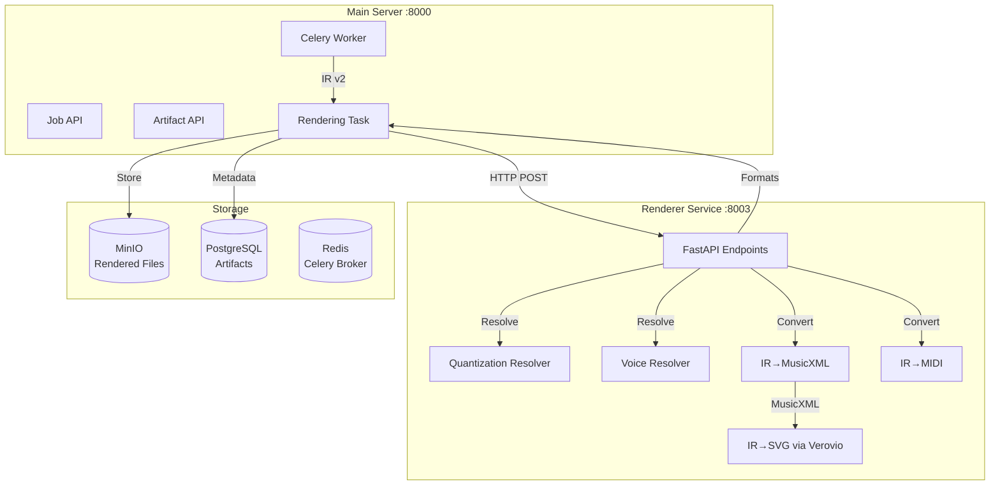

# Phase 4: Renderer Service Im

plementation

## Overview

This phase implements the **presentation layer** of Étude: converting enriched Symbolic IR v2 (with fingering annotations) into user-facing formats:

- **IR v2 → MusicXML**: Engraving-optimized notation with fingering tags
- **IR v2 → MIDI**: Playback format with accurate timing
- **IR v2 → SVG**: Visual rendering using Verovio

This is a **lossy transformation** that commits to specific interpretations (quantization, voice assignments, layout) while preserving fingering annotations.

## Architecture

## Implementation Tasks

### Task 4.1: Renderer Service Structure

**Files to create:**

- `services/renderer/Dockerfile` - Container definition
- `services/renderer/requirements.txt` - Dependencies (fastapi, music21, mido, verovio, lxml)
- `services/renderer/app/__init__.py` - Package initialization
- `services/renderer/app/main.py` - FastAPI application
- `services/renderer/app/config.py` - Configuration with Pydantic Settings
- `services/renderer/README.md` - Service documentation

**Key dependencies:**

- `fastapi`, `uvicorn` - API framework
- `music21` - Music notation library (optional, for validation)
- `mido` - MIDI library
- `verovio` - SVG rendering from MusicXML
- `lxml` - XML processing for MusicXML generation

### Task 4.2: Quantization and Resolution

**Files to create:**

- `services/renderer/app/resolvers/__init__.py`
- `services/renderer/app/resolvers/quantization.py` - Quantize timing to standard note values
- `services/renderer/app/resolvers/voice_resolver.py` - Resolve voice assignments for polyphony
- `services/renderer/app/resolvers/layout_resolver.py` - Layout decisions (optional, for future)

**Key responsibilities:**

- **QuantizationResolver**: Convert continuous time to discrete note durations (whole, half, quarter, etc.)
- **VoiceResolver**: Assign voices to minimize crossings in polyphonic music
- Handle tolerance for quantization (default 0.05 beats = 50ms)
- Support standard note durations with dots

### Task 4.3: MusicXML Converter

**Files to create:**

- `services/renderer/app/converters/__init__.py`
- `services/renderer/app/converters/ir_to_musicxml.py` - Convert IR v2 to MusicXML
- `services/renderer/app/utils/musicxml_builder.py` - Helper functions for MusicXML elements

**Key features:**

- Generate valid MusicXML 4.0 structure
- Include fingering annotations as `<technical><fingering>` elements
- Support grand staff (piano) with multiple staves
- Handle key signatures, time signatures, clefs
- Preserve dynamics and articulations
- Place fingering above (right hand) or below (left hand)

**MusicXML structure:**

- `<score-partwise>` root
- `<part-list>` with staff definitions
- `<part>` elements with `<measure>` elements
- Notes with pitch, duration, voice, staff, and fingering

### Task 4.4: MIDI Converter

**Files to create:**

- `services/renderer/app/converters/ir_to_midi.py` - Convert IR v2 to MIDI

**Key features:**

- Generate standard MIDI file format
- Accurate timing from IR v2 temporal data
- Support tempo changes
- Support time signature changes
- Note-on/note-off events with correct velocities
- MIDI doesn't support fingering (playback only)

**Implementation:**

- Use `mido` library for MIDI generation
- Convert beats to MIDI ticks (default 480 ticks per quarter)
- Generate note_on/note_off events sorted by time

### Task 4.5: SVG Converter (Verovio)

**Files to create:**

- `services/renderer/app/converters/ir_to_svg.py` - Convert MusicXML to SVG via Verovio

**Key features:**

- Use Verovio toolkit to render MusicXML to SVG
- Support multi-page rendering
- Configurable page size (A4 default)
- Configurable scale and margins
- Return list of SVG strings (one per page)

**Implementation:**

- Verovio takes MusicXML as input (not IR directly)
- Configure Verovio options (scale, page dimensions, margins)
- Render each page separately
- Return SVG strings

### Task 4.6: Renderer Service API

**Files to create:**

- `services/renderer/app/schemas/__init__.py`
- `services/renderer/app/schemas/request.py` - Request schemas (if needed)
- `services/renderer/app/schemas/response.py` - Response schemas (RenderResponse, HealthResponse)

**Files to modify:**

- `services/renderer/app/main.py` - Complete FastAPI app with:
- `/health` endpoint
- `/render` endpoint (POST with IR v2, returns all formats)
- `/render/musicxml` convenience endpoint
- `/render/midi` convenience endpoint
- `/render/svg` convenience endpoint (returns SVG pages)
- In-memory caching for repeated renders
- Error handling

**API design:**

- Accept IR v2 as JSON in request body
- Support format selection: `formats=["musicxml", "midi", "svg"]`
- Return base64-encoded bytes for MIDI, strings for MusicXML/SVG
- Include processing time in response

### Task 4.7: Celery Task Integration

**Files to create:**

- `server/app/tasks/rendering_tasks.py` - Celery task for rendering

**Files to modify:**

- `server/app/tasks/fingering_tasks.py` - Trigger rendering after fingering completes
- `server/app/config.py` - Add `RENDERER_SERVICE_URL` setting
- `server/app/core/state_machine.py` - Ensure `RENDERING_PROCESSING` status exists

**Task flow:**

1. Load IR v2 artifact
2. Call renderer service with IR v2
3. Store MusicXML, MIDI, SVG artifacts
4. Update job status to `COMPLETED`
5. Handle errors and update status to `FAILED`

### Task 4.8: Artifact Storage Integration

**Files to modify:**

- `server/app/services/artifact_service.py` - Already supports MUSICXML, MIDI, SVG types
- `server/app/api/v1/artifacts.py` - Download endpoint already exists (verify content types)

**Storage paths:**

- MusicXML: `jobs/{job_id}/artifacts/{artifact_id}.musicxml`
- MIDI: `jobs/{job_id}/artifacts/{artifact_id}.mid`
- SVG: `jobs/{job_id}/artifacts/{artifact_id}_page_{n}.svg` (one per page)

**Lineage:**

- All rendered artifacts have IR v2 as parent
- Maintain transformation chain: PDF → IR v1 → IR v2 → MusicXML/MIDI/SVG

### Task 4.9: Docker Compose Integration

**Files to modify:**

- `docker-compose.yml` - Add renderer service:
- Port 8003
- Environment variables for configuration
- Health check endpoint
- Network configuration
- Volume mounts for development

**Service configuration:**

- Build from `./services/renderer`
- Expose port 8003
- Add to `etude_network`
- Health check: `curl http://localhost:8003/health`

### Task 4.10: Testing

**Files to create:**

- `services/renderer/tests/__init__.py`
- `services/renderer/tests/test_musicxml.py` - Test MusicXML conversion
- `services/renderer/tests/test_midi.py` - Test MIDI conversion
- `services/renderer/tests/test_svg.py` - Test SVG rendering
- `services/renderer/tests/test_resolvers.py` - Test quantization and voice resolution
- `services/renderer/tests/fixtures/` - Test IR v2 fixtures
- `server/tests/test_rendering_integration.py` - End-to-end integration tests

**Test coverage:**

- Quantization accuracy
- Voice assignment correctness
- MusicXML validity (can validate with music21)
- MIDI playback (can test with MIDI players)
- SVG rendering quality
- Fingering preservation in MusicXML
- Multi-staff piano scores
- Full pipeline: PDF → OMR → Fingering → Rendering

## Key Design Decisions

1. **Lossy Transformation**: Quantization and voice resolution commit to specific interpretations. This is intentional - we're creating concrete notation.
2. **MusicXML First**: SVG is generated from MusicXML (via Verovio), not directly from IR. This ensures consistency.
3. **Fingering Preservation**: Fingering annotations are preserved in MusicXML using standard `<technical><fingering>` elements.
4. **Caching**: In-memory cache for repeated renders of the same IR v2. Cache key based on IR content hash + format list.
5. **Error Handling**: Graceful degradation - if one format fails, others can still succeed.
6. **Quantization Tolerance**: Default 0.05 beats (50ms) allows slight timing variations while maintaining readability.

## Critical Implementation Notes

1. **Note Duration Mapping**: IR uses continuous time; MusicXML needs discrete durations. Map to standard values (whole, half, quarter, eighth, etc.) with dots.
2. **Voice Assignment**: For polyphonic music, assign voices to minimize crossings. Use pitch ordering within chords.
3. **Grand Staff**: Piano scores need special handling - two staves in one part with staff numbers.
4. **MIDI Timing**: Ensure MIDI timing matches IR temporal data accurately for playback synchronization.
5. **Verovio Configuration**: Tune scale, page size, and margins for optimal SVG output quality.
6. **Base64 Encoding**: MIDI bytes must be base64-encoded in JSON responses.

## Files Summary

**New files (renderer service):**

- `services/renderer/Dockerfile`
- `services/renderer/requirements.txt`
- `services/renderer/app/main.py`
- `services/renderer/app/config.py`
- `services/renderer/app/converters/ir_to_musicxml.py`
- `services/renderer/app/converters/ir_to_midi.py`
- `services/renderer/app/converters/ir_to_svg.py`
- `services/renderer/app/resolvers/quantization.py`
- `services/renderer/app/resolvers/voice_resolver.py`
- `services/renderer/app/schemas/response.py`
- `services/renderer/app/utils/musicxml_builder.py` (optional helper)
- `services/renderer/tests/test_musicxml.py`
- `services/renderer/tests/test_midi.py`
- `services/renderer/tests/test_svg.py`
- `services/renderer/README.md`

**New files (main server):**

- `server/app/tasks/rendering_tasks.py`

**Modified files:**

- `docker-compose.yml` - Add renderer service
- `server/app/config.py` - Add `RENDERER_SERVICE_URL`
- `server/app/tasks/fingering_tasks.py` - Trigger rendering after fingering
- `server/app/api/v1/artifacts.py` - Verify download endpoint handles new formats

## Acceptance Criteria

- [ ] Renderer service Docker container builds and runs
- [ ] Health check endpoint returns healthy status
- [ ] IR v2 → MusicXML conversion works correctly
- [ ] MusicXML includes `<fingering>` tags from IR v2
- [ ] Multi-staff piano scores render correctly
- [ ] IR v2 → MIDI conversion produces playable files
- [ ] Verovio generates SVG pages from MusicXML
- [ ] Quantization resolver handles timing correctly
- [ ] Voice resolver assigns voices without crossing errors
- [ ] All three formats (MusicXML, MIDI, SVG) generated successfully
- [ ] Rendered artifacts stored with correct lineage
- [ ] Download endpoints work for all format types
- [ ] Full pipeline: PDF → OMR → Fingering → Rendering → Download
- [ ] Job status updates correctly through all stages
- [ ] Caching reduces redundant rendering

## Next Steps

After Phase 4 completion, proceed to **Phase 5: Flutter Client - Core**, where you'll build the mobile/web interface to:

- Upload PDFs
- Display rendered scores with fingering overlays
- Play MIDI
- Show confidence indicators